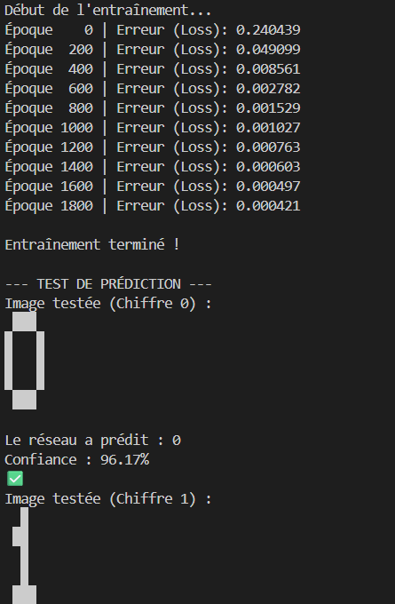
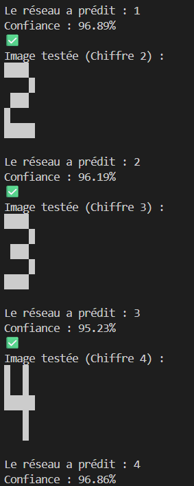
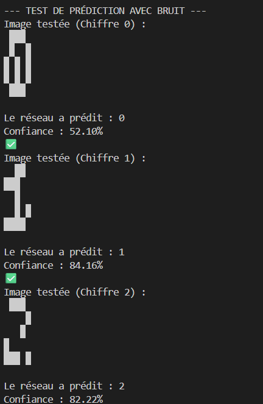
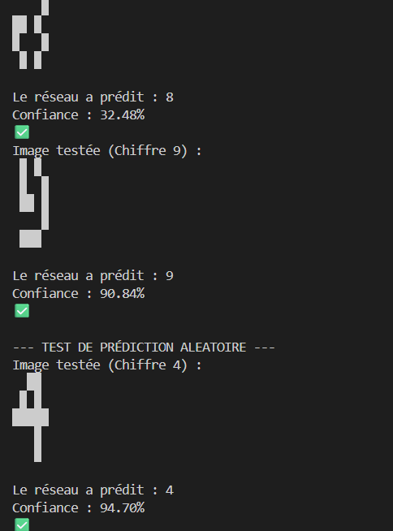

# MatrixDigit-MLP : Réseau de Neurones From Scratch

Ce projet est une implémentation pédagogique d'un Perceptron Multicouche (MLP) construit entièrement avec NumPy..

L'objectif est de comprendre les mécanismes fondamentaux du Deep Learning : de l'initialisation des poids à la rétropropagation de l'erreur.

## Fonctionnalités

Architecture : Entrée (25 pixels) ➔ Couche Cachée (16 neurones) ➔ Sortie (10 classes).

Entraînement : Algorithme de descente de gradient avec calcul manuel de la backpropagation.

Fonction d'activation : Sigmoïde (avec sa dérivée pour l'apprentissage).

Robustesse : Capacité du modèle à prédire des chiffres même avec du "bruit" (pixels aléatoirement inversés).

## Comment ça marche ?

1. Structure du modèle
   Le réseau prend en entrée une matrice de 5x5 pixels (aplatie en un vecteur de 25).

Input (25) : Chaque pixel de l'image.

Hidden Layer (16) : Apprend les formes intermédiaires (lignes, boucles).

Output (10) : Un score de probabilité pour chaque chiffre de 0 à 9.

2. Le cycle d'apprentissage
   Pour chaque itération (Epoch), le modèle suit ces étapes :

Forward Pass : Calcul des sommes pondérées et application de la fonction Sigmoïde.

Calcul du Loss : Mesure de l'erreur (Mean Squared Error) entre la prédiction et le label réel.

Backpropagation : Calcul des gradients en partant de la sortie pour identifier la responsabilité de chaque poids dans l'erreur.

Mise à jour : Ajustement des poids et des biais via le learning_rate.

## Sortie du programme:

